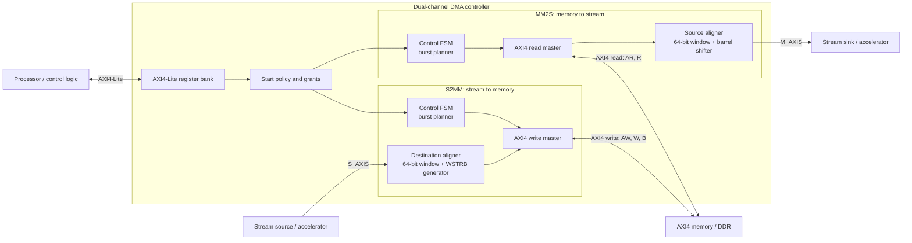
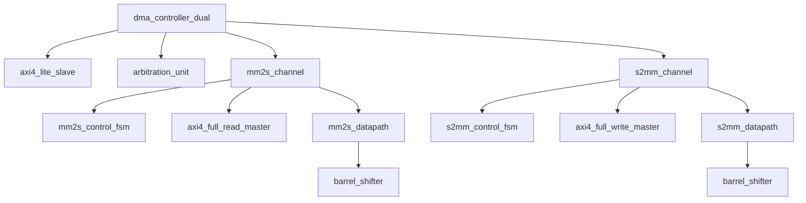
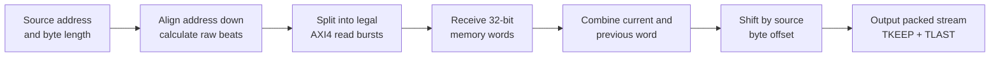
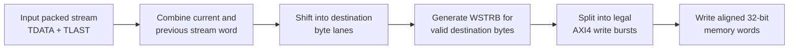
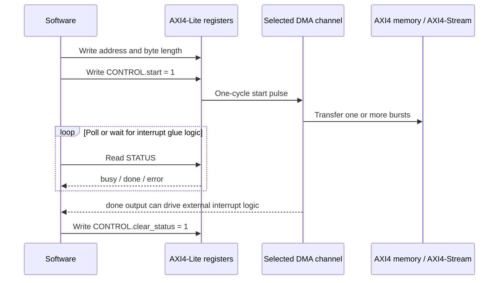

# Dual-Channel DMA Controller with Unaligned Transfer Support

## Overview

This repository contains a synthesizable, 32-bit Direct Memory Access (DMA)
controller written in Verilog. It is intended for FPGA and SoC designs in which
software needs to move data between an AXI4 memory-mapped address space and
AXI4-Stream peripherals.

The controller provides two independent channels:

- **MM2S (Memory-Mapped to Stream):** reads bytes from memory and emits them on
  an AXI4-Stream master interface.
- **S2MM (Stream to Memory-Mapped):** accepts bytes from an AXI4-Stream slave
  interface and writes them to memory.

Both channels support byte-unaligned start addresses. Small barrel-shifter
datapaths realign data as it moves through the controller, so a transfer does
not need to be copied into a transfer-sized alignment buffer. The channels have
separate AXI4 read and write paths and can be active at the same time.

> [!IMPORTANT]
> MM2S and S2MM are independent endpoints. The controller does not internally
> connect its stream output to its stream input. For a memory-to-memory copy,
> connect `m_axis_*` to `s_axis_*` directly or through AXI4-Stream
> infrastructure such as a FIFO, switch, or processing block.

## Key features

- Independent MM2S and S2MM channels with simultaneous-operation support
- 32-bit AXI4 memory and AXI4-Stream data paths
- Byte-unaligned source and destination addresses (offsets 0, 1, 2, or 3)
- Combinational barrel-shifter alignment with one retained 32-bit word per
  alignment datapath
- AXI4 INCR burst generation with a configurable maximum burst length
- Automatic burst splitting at AXI 4 KiB address boundaries
- AXI4-Lite configuration and status register bank
- AXI backpressure propagation throughout the read, stream, and write paths
- Error reporting for AXI response failures and malformed S2MM `TLAST`
- Self-checking Icarus Verilog regression suite

## System architecture

The processor configures each channel through AXI4-Lite. The MM2S channel owns
the AXI4 read channels (`AR` and `R`), while the S2MM channel owns the AXI4
write channels (`AW`, `W`, and `B`). Because those paths are independent, the
two channels can transfer concurrently when the connected memory system allows
it.



### Module hierarchy



| Module | Responsibility |
|---|---|
| `dma_controller_dual` | Top-level integration and external bus interfaces |
| `axi4_lite_slave` | Software-visible configuration, command, and status registers |
| `arbitration_unit` | Converts start requests into channel grants; simultaneous mode is enabled at the top level |
| `mm2s_channel` | Integrates MM2S control, AXI read, and source-alignment blocks |
| `mm2s_control_fsm` | Plans aligned read bursts and tracks MM2S completion and errors |
| `axi4_full_read_master` | Issues AXI4 INCR reads and validates read responses and `RLAST` |
| `mm2s_datapath` | Removes the source-byte offset and generates `TDATA`, `TKEEP`, and `TLAST` |
| `s2mm_channel` | Integrates S2MM control, destination alignment, and AXI write blocks |
| `s2mm_control_fsm` | Plans aligned write bursts and tracks S2MM completion and errors |
| `s2mm_datapath` | Places stream bytes at the destination offset and generates `WSTRB` |
| `axi4_full_write_master` | Issues AXI4 INCR writes and checks the write response |
| `barrel_shifter` | Reusable combinational right-shift network used by both aligners |
| `fifo` | Standalone synchronous FIFO included and tested separately; it is not instantiated in `dma_controller_dual` |

## How a transfer works

### MM2S: memory to AXI4-Stream



1. Software supplies a byte address and a byte count.
2. The control FSM rounds the source address down to a 4-byte boundary.
3. It calculates the number of raw memory beats required:

   ```text
   raw_beats = ceil((source_offset + transfer_length) / 4)
   ```

4. The AXI read master fetches those aligned 32-bit words.
5. For an unaligned transfer, the datapath retains one previous word and forms
   a 64-bit `{current_word, previous_word}` window. A barrel shifter removes
   the unwanted leading bytes.
6. The packed result is sent on `m_axis_tdata`. `m_axis_tkeep` marks the valid
   bytes in the final beat, and `m_axis_tlast` marks the end of the requested
   byte count.

### S2MM: AXI4-Stream to memory



1. Software supplies a destination byte address and byte count.
2. The control FSM rounds the destination address down to a 4-byte boundary
   and calculates the required number of write beats.
3. The datapath shifts incoming stream bytes into the correct memory byte
   lanes. When bytes cross a word boundary, one previous stream word is
   retained to build the next output word.
4. `m_axi_wstrb` enables only the bytes belonging to the requested range. This
   preserves memory immediately before and after an unaligned transfer.
5. The datapath compares the incoming `s_axis_tlast` position with the
   programmed byte count. An early or missing `TLAST` is reported through the
   S2MM error status bit.

### Unaligned-transfer example

For a six-byte S2MM transfer to address `0x1001`, the first byte belongs in
lane 1 of the aligned word at `0x1000`. Three bytes fit in that word and the
remaining three bytes continue at `0x1004`.

```text
Requested destination: 0x1001
Input byte sequence:    A0 A1 A2 A3 A4 A5

Aligned AXI address     Byte lane 3   Byte lane 2   Byte lane 1   Byte lane 0    WSTRB
0x0000_1000                 A2            A1            A0          unchanged     1110
0x0000_1004              unchanged        A5            A4             A3         0111
```

The corresponding MM2S operation performs the inverse transformation: it reads
aligned words, discards the unwanted leading byte lanes, and emits a packed
stream beginning with the byte at the exact programmed source address.

## Burst planning and AXI behavior

Each control FSM divides a transfer into one or more aligned AXI4 INCR bursts.
A planned burst is limited by all of the following:

- the number of beats still required by the transfer;
- the `BURST_MAX` parameter (16 beats by default);
- the AXI limit of 256 beats encoded by `ARLEN`/`AWLEN`; and
- the number of complete 4-byte beats remaining before the next 4 KiB boundary.

All memory beats are 4 bytes (`AxSIZE = 2`) in the default 32-bit design. AXI
valid/data signals remain subject to standard ready/valid handshakes, so memory
or stream backpressure pauses the affected datapath without losing data.

## Interfaces

The top-level module is `dma_controller_dual` in
[`rtl/dma_controller_dual.v`](rtl/dma_controller_dual.v).

| Interface group | Direction relative to DMA | Purpose |
|---|---:|---|
| `s_axi_*` | Slave | AXI4-Lite register access from a processor or control master |
| `m_axi_ar*`, `m_axi_r*` | Master | AXI4 MM2S read-address and read-data channels |
| `m_axi_aw*`, `m_axi_w*`, `m_axi_b*` | Master | AXI4 S2MM write-address, write-data, and response channels |
| `m_axis_*` | Master | MM2S output stream; includes `TKEEP` and `TLAST` |
| `s_axis_*` | Slave | S2MM input stream; includes `TLAST` |
| `mm2s_status`, `s2mm_status` | Output | Direct copies of the software-readable status values |
| `mm2s_done`, `s2mm_done` | Output | One-clock completion pulses for optional hardware-side use |

### Parameters

| Parameter | Default | Description |
|---|---:|---|
| `DATA_WIDTH` | `32` | Memory and stream data width. The current byte-lane and alignment logic is designed for 32-bit operation. |
| `ADDR_WIDTH` | `32` | AXI4 memory address width |
| `BURST_MAX` | `16` | Maximum requested beats per AXI burst; values above 256 are clamped by the planner |

## Register map

All registers are 32 bits wide and use byte addressing. Address and length
registers honor AXI4-Lite `WSTRB`. Control commands are accepted from byte lane
0 and automatically return to zero after one clock; they are command pulses,
not persistent mode bits.

| Offset | Name | Access | Reset | Description |
|---:|---|:---:|---:|---|
| `0x00` | `MM2S_SRC_ADDR` | R/W | `0` | First memory byte to read |
| `0x04` | `MM2S_LENGTH` | R/W | `0` | Number of bytes to emit on `M_AXIS` |
| `0x08` | `MM2S_CONTROL` | R/W1P | `0` | Bit 0: start; bit 1: clear status |
| `0x0C` | `MM2S_STATUS` | R | `0` | Bit 0: busy; bit 1: done; bit 2: error |
| `0x10` | `S2MM_DST_ADDR` | R/W | `0` | First memory byte to write |
| `0x14` | `S2MM_LENGTH` | R/W | `0` | Number of stream bytes to accept |
| `0x18` | `S2MM_CONTROL` | R/W1P | `0` | Bit 0: start; bit 1: clear status |
| `0x1C` | `S2MM_STATUS` | R | `0` | Bit 0: busy; bit 1: done; bit 2: error |

`R/W1P` means that writing a one produces a one-clock pulse. Invalid or
unaligned AXI4-Lite addresses return `SLVERR`; an invalid read returns
`0xDEAD_BEEF` as its data value.

### Status lifecycle

| State | `busy` | `done` | `error` |
|---|:---:|:---:|:---:|
| After reset or clear-status command | 0 | 0 | 0 |
| Transfer in progress | 1 | 0 | 0 |
| Successful completion | 0 | 1 | 0 |
| Completion with a detected error | 0 | 1 | 1 |

The completion status remains visible until a clear-status command or a new
transfer changes it. A zero-length start is ignored. Start and clear commands
should be issued only while the selected channel is idle; a command pulse sent
while it is busy is not queued.

## Programming sequence

The two channels use the same basic software sequence.



Example pseudocode for MM2S:

```c
dma_write(MM2S_SRC_ADDR, source_address);
dma_write(MM2S_LENGTH,   byte_count);
dma_write(MM2S_CONTROL,  1u << 0);       // start pulse

do {
    status = dma_read(MM2S_STATUS);
} while ((status & (1u << 1)) == 0);      // wait for done

if (status & (1u << 2)) {
    /* Handle AXI read or protocol error. */
}

dma_write(MM2S_CONTROL, 1u << 1);        // clear status pulse
```

To launch both channels together, program both address/length pairs and issue
their start writes close together. Since simultaneous mode is enabled in
`dma_controller_dual`, both requests can be granted when both channels are
idle.

## Repository layout

```text
DMA/
|-- rtl/                 Synthesizable Verilog RTL
|   |-- dma_controller_dual.v
|   |-- axi4_lite_slave.v
|   |-- arbitration_unit.v
|   |-- mm2s_*.v
|   |-- s2mm_*.v
|   |-- axi4_full_*_master.v
|   |-- barrel_shifter.v
|   `-- fifo.v
|-- tb/                  Self-checking testbenches
|-- run.tcl              Complete Icarus Verilog regression runner
`-- README.md
```

## Verification

### Prerequisites

Install the following tools and make them available on `PATH`:

- [Icarus Verilog](https://steveicarus.github.io/iverilog/) (`iverilog` and
  `vvp`)
- Tcl (`tclsh`)

### Run the regression

From the repository root:

```powershell
tclsh run.tcl
```

The runner compiles every test into a temporary system directory and executes
the following self-checking testbenches:

| Testbench | Main coverage |
|---|---|
| `axi4_test.v` | AXI4-Lite decoupled write channels, strobes, reads, and invalid-address responses |
| `fifo_tb.v` | Standalone FIFO ordering and status behavior |
| `tb_axi4_full_read_master.v` | Read handshakes, backpressure, response errors, and `RLAST` checking |
| `tb_axi4_full_write_master.v` | Write handshakes, burst termination, and response errors |
| `tb_s2mm_datapath.v` | Destination shifting, flushing, strobes, and `TLAST` validation |
| `tb_s2mm_control_fsm.v` | Command planning, maximum burst splitting, and 4 KiB boundary handling |
| `tb_s2mm_channel.v` | Integrated stream-to-memory transfer behavior |
| `tb_dma_controller_s2mm.v` | AXI4-Lite-controlled S2MM top-level operation |
| `tb_alignment_matrix.v` | 136 MM2S/S2MM combinations: offsets 0-3 and lengths 1-17 |
| `tb_dma_controller_dual.v` | Concurrent unaligned MM2S and S2MM operation with simultaneous AXI read/write activity |

A successful run ends with:

```text
ALL REGRESSION TESTS PASSED
```

## FPGA integration example

For a Zynq-7000 design in Vivado:

1. Connect the DMA AXI4-Lite slave to a Processing System `M_AXI_GP` port.
2. Connect the AXI4 memory read/write signals to a PS `S_AXI_HP` port through
   AXI SmartConnect or equivalent interconnect.
3. Connect `m_axis_*` and `s_axis_*` to the intended streaming peripherals. For
   an initial DDR-to-DDR test, loop the MM2S stream to the S2MM stream.
4. Drive `clk` from `FCLK_CLK0` (or another common AXI clock) and use a
   synchronized active-low peripheral reset for `rst_n`.
5. Optionally route `mm2s_done` and `s2mm_done` through interrupt-controller
   glue logic if polling is not desired.

All interfaces in the current top level share one clock and reset domain. Add
appropriate AXI clock converters or stream clock converters before connecting
logic in a different clock domain.

## Design scope and current limitations

- The implemented byte-lane masks, offsets, and stream `TKEEP` are specifically
  32 bits / 4 bytes wide even though `DATA_WIDTH` is exposed as a parameter.
- AXI IDs, protection, cache, QoS, and lock signals are not generated by this
  core; tie or adapt them as required by the target interconnect wrapper.
- Scatter-gather descriptors and linked-list operation are not implemented.
- There is no built-in data-width conversion or clock-domain crossing.
- A start request received while its channel is busy is ignored rather than
  queued.
- Completion outputs are one-clock pulses; software-visible status bits remain
  latched until cleared.

## Resource-evaluation guidance

The alignment logic is intended to reduce temporary storage compared with an
architecture that buffers a large part of each transfer. To evaluate that
claim fairly, synthesize this design and the reference buffered design using
the same FPGA part, clock constraint, bus width, maximum burst length, and tool
settings. Compare the DMA hierarchy's BRAM, distributed RAM, LUT, flip-flop,
and timing results. Exclude debug ILA storage and test-memory BRAM from the
alignment-memory comparison.
